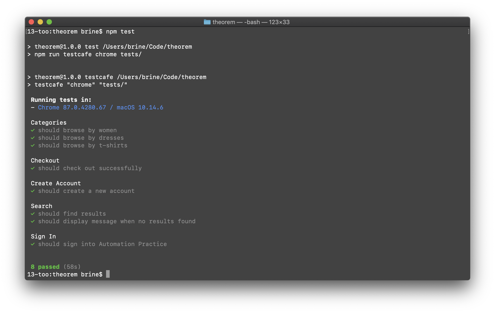

# Theorem Exercise
> E2E tests written in [Testcafe](https://github.com/DevExpress/testcafe)

## Setup
1. clone `clone git@github.com:qualityshepherd/theorem.git`
2. install `npm i`

## Run 'Em
* `npm test` runs all tests in a single browser window
* `npm run headless` runs all tests _headlessly_ in parallel (x2)
* `npm run` to see more options
* custom: `npm run testcafe -- [options] [browser] [tests]`

## Test Suite
- [x] sign in
- [x] checkout/shopping cart
- [x] search
- [x] create account
- [x] browse categories
- [x] _(freebie)_ runs on [Codeship CI](https://codeship.com/)
- [ ] social media sharing

## If I had more time:
- would use API to add available products to cart
- would confirm order _perhaps by order id in url?_ or something more robust that an alert msg

